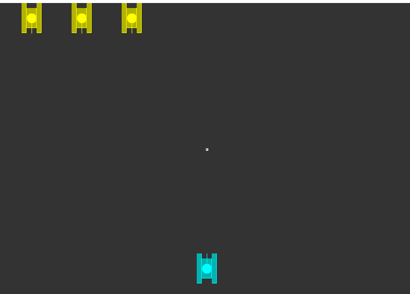

# Java 坦克大战游戏

## 项目简介

Java 坦克大战游戏是一款经典的单人游戏，玩家可以控制坦克在地图上移动、射击并与其他玩家或敌人交互。 
本项目是一个基于 Java 编写的坦克大战游戏的简单实现。

## 游戏特点
- 坦克操作：玩家可以控制坦克的移动、旋转和射击。
- 关卡：游戏包含不同的关卡，增加了游戏的多样性和挑战性。
- 敌人：游戏中会有敌人坦克，具有基本的操作 。
- 得分和统计：记录玩家得分并提供统计信息。

## 游戏截图

## 如何运行

1. 克隆或下载本仓库到您的本地计算机。
2. 使用 Java 开发工具（如 Eclipse、IntelliJ IDEA 等）打开项目。
3. 编译和运行 `App.java` 文件。
4. 进入游戏并按照游戏指南进行操作。

## 游戏操作

- 使用键盘方向键控制坦克的移动。
- 使用空格键进行射击。
- 更多操作和游戏规则请查阅游戏内帮助文档。

## 技术栈

- Java 编程语言
- Java Swing（用于用户界面）
- Java 集合
- Java 多线程

## 贡献

如果您想为项目做出贡献，请遵循以下步骤：

1. Fork 本仓库。
2. 创建一个新的分支并进行开发。
3. 提交 Pull Request。

## 许可证

本项目基于 [MIT 许可证](LICENSE)。

感谢您的兴趣和支持！
